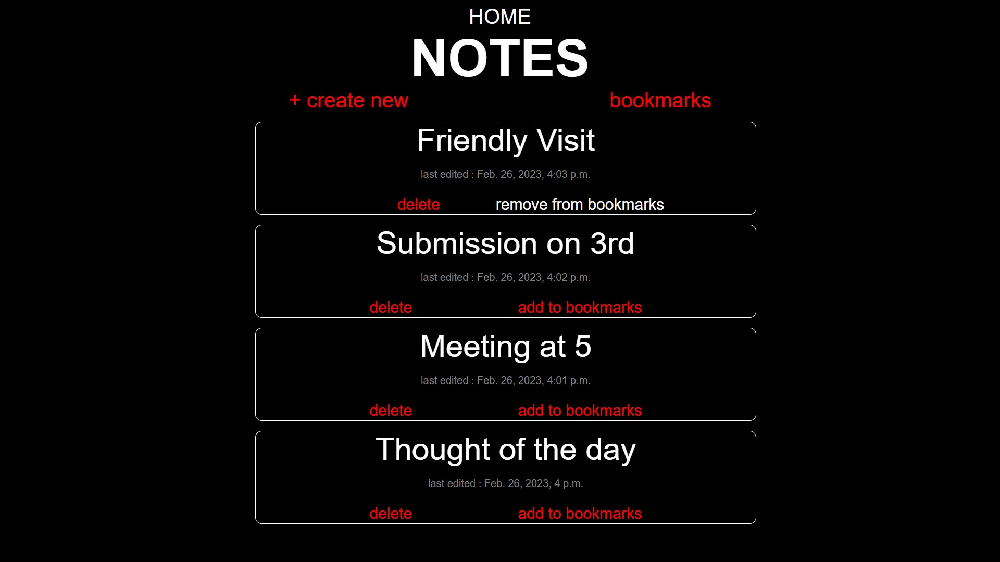
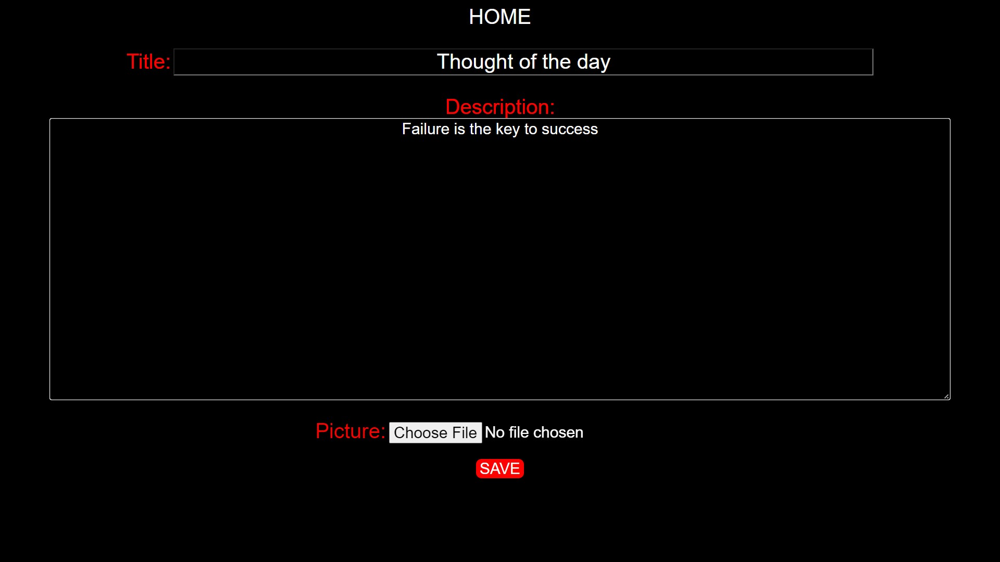
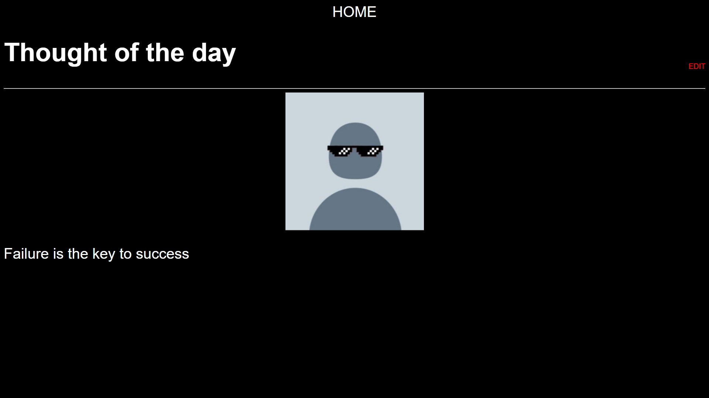
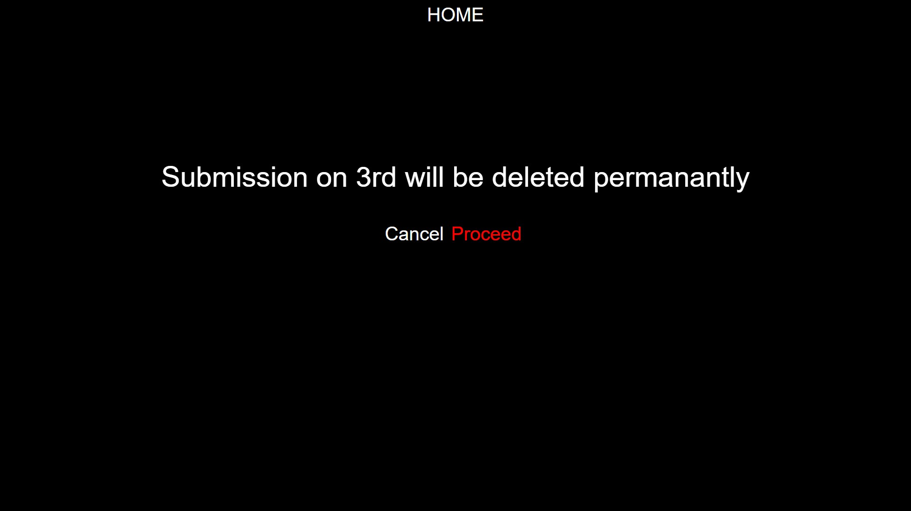
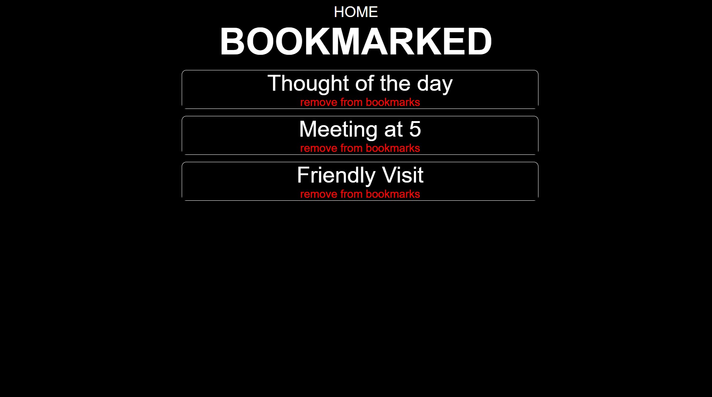

# 
 NOTES APP 

## 
 This is a NOTES application developed using Django and Rest Framework where you can jot down quick thoughts 

# 
Preview 

### 
Home Page

###

### 
Create a new note

###

### 
Modify Notes

###

### 
Delete Notes

###

### 
View Bookmarks

###